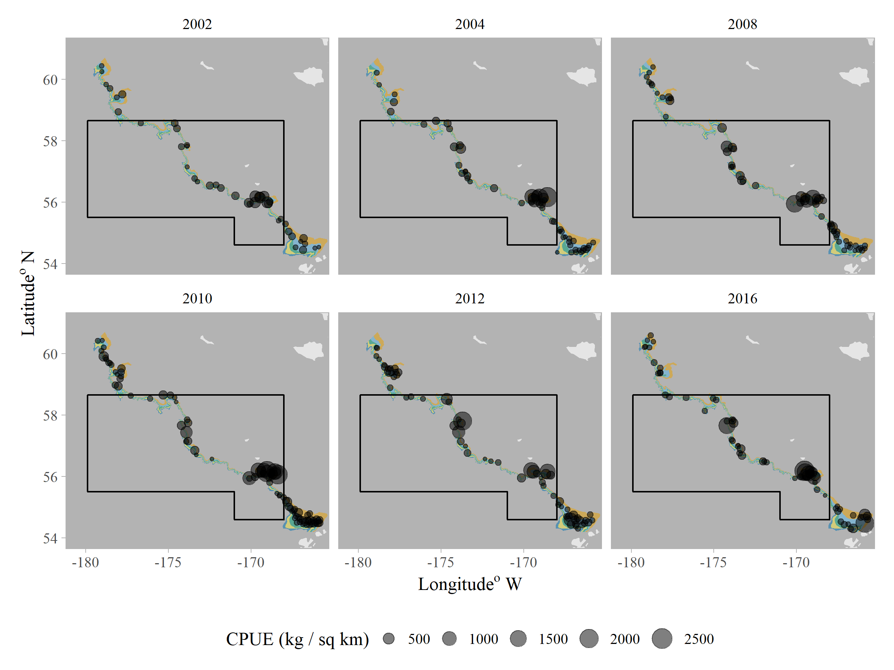
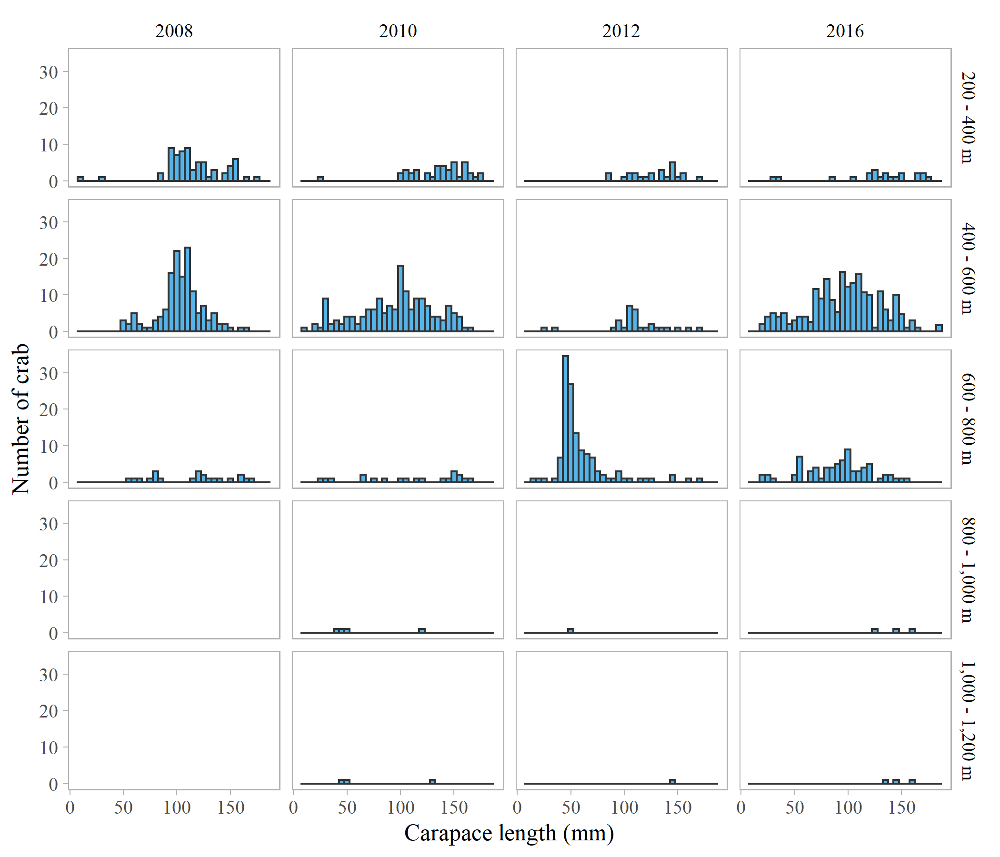

```{r, echo = F, message = F, warning = F}
library(tidyverse)
library(xtable)

knitr::opts_chunk$set(echo=FALSE, message=FALSE, warning=FALSE, fig.pos='H')


```

```{r, echo = F, message = F, warning = F, results = 'hide'}
source("./pigkc2023_tier4.R")
```

The PIGKC stock is currently managed as Tier 5, but we present Tier 4 calculations here. While fishery catch data are available, the OFL calculation presented here uses only NMFS-AFSC eastern Bering Sea continental slope bottom trawl survey data.  

# Data {-}
## Survey biomass estimates and length composition {-}
The NMFS-AFSC conducted an eastern Bering Sea continental slope bottom trawl survey in 2002, 2004, 2008, 2010, 2012, and 2016. The slope survey was a multi-species survey stratified by subarea and depth (Hoff and Britt 2003, 2005, 2009, 2011; Hoff 2013, 2016), and is the sole fishery independent data source for estimating mature male biomass (MMB) of Pribilof Islands golden king crab (PIGKC, $Lithodes$ $aequispinus$). Results of the 2002–2016 surveys showed that a majority of golden king crab on the eastern Bering Sea continental slope occurred in the 200–400 m and 400–600 m depth ranges (Hoff and Britt 2003, 2005, 2009, 2011; Hoff 2013, 2016). Biomass, number, and density (in number per area and in weight per area) of golden king crab on the eastern Bering Sea continental slope are higher in the southern areas than in the northern areas, with highest abundance in survey subarea 2 (Pengilly and Daly 2017). For the purpose of this document, we focus on survey within the ADF\&G Pribilof District Management Area (PDMA, Figs. 1-3, ADF\&G 2017). Length composition data are available for 2008-2016 surveys but not the 2002 and 2004 surveys (Figure \ref{fig:sizecomp}). For the 2008-2016 surveys, we applied length-weight regression to size composition data to estimate the weight of each crab measured. MMB was calculated using a maturity size cut-off of 107 mm CL (Somerton and Otto 1986). An area-swept estimate of biomass and of the variance of the biomass estimate was computed for each stratum within a survey subarea and summed over strata within to obtain to obtain biomass estimates in aggregate and the variances of those estimates. Since length composition data were not available for 2002 and 2004, MMB estimates were obtained by first estimating total biomass associated variance for 2002 and 2004, and then multiplying it by the ratio of MMB to total biomass in 2008-2016 ($r_{2008-2016}$). CVs for 2002 and 2004 were computed as the variance of the division of two random variables, using the variance of total biomass in those years and the variance in $r_{2008-2016}$.

## Available data not used in analysis {-}
\begin{itemize}

\item The 1981/82–1983/84, 1984–2021 time series of retained catch (number and weight of crab, including deadloss), effort (vessels and pot lifts), average weight of landed crab, average carapace length of landed crab, and CPUE (number of landed crab captured per pot lift).

\item The 1993–2022 time series of weight of retained catch (1993 - 2021) and estimated weight of discarded catch (2001 - 2010) and estimated weight of fishery mortality of Pribilof golden king crab during the directed fishery and non-directed crab fisheries (1993 - 2022).

\item The groundfish fishery discarded catch data (grouped into crab fishery years from 1991/92–2008/09, and by calendar years from 2009–2022).

\item Retained catch size composition data for 2001-2021.

\end{itemize}

## Growth per molt {-}
The authors are not aware of data on growth per molt collected from golden king crab in the Pribilof District. Growth per molt of juvenile golden king crab, 2–35 mm CL, collected from Prince William Sound have been observed in a laboratory setting and equations describing the increase in CL and intermolt period were estimated from those observations (Paul and Paul 2001a); those results are not provided here. Growth per molt has also been estimated from golden king crab with CL $\geq$ 90 mm that were tagged in the Aleutian Islands and recovered during subsequent commercial fisheries (Watson et al. 2002); those results are not used in the OFL calculation and therefore not presented here.

## Weight-at length (by sex) {-}
Parameters (A and B) used for computing weight (g) from carapace length (CL, mm) of golden king crab by $Weight = A*CL^{B}$, were estimated using data collected as part of an ADF\&G special collection during the directed fishery (not at-sea observer) for males (A = 0.0002712 and B = 3.168). Female specific parameters (A = 0.0014240 and B = 2.781) were those specified in the FMP (NPFMC 2007, Table 3-5).

## Natural mortality rate {-}
The default natural mortality rate assumed for king crab species by NPFMC (2007) is M = 0.18. Here, calculations using M = 0.21, consistent with Aleutian Island golden king crab (Siddeek et al., 2022), are also presented for comparison.

# Analytic Approach {-}
The PIGKC stock assessment has followed the Tier 5 methodology since 2012, but interest in a Tier 4 method using a random effect model and NMFS-AFSC EBS slope survey data has received growing interest. In 2017, total biomass and mature male biomass were estimated by a random effects (RE) method with the inclusion of the 2016 survey data. At that time, the CPT recommended to use the Tier 5 assessment until the model was further explored and/or additional survey data was available. The RE model approach was revisited in 2020, using proxy estimates of MMB for 2002 and 2004 based on the ratio of MMB to total biomass in other survey years. Again, the CPT recommended to use the Tier 5 assessment due to the lack of documentation associated with the particular version of the RE model used and uncertainty in the availability of future fishery independent data (CPT 2020). Here, we further explore the utility of the latest version of the RE model within the R package $rema$ (Sullivan et al. 2022), though there has been no additional fishery-independent data since the 2016 survey, thus the time series used in this analysis is the same as in the 2020 assessment.

## Model {-}
Various versions of the RE model have been in use by the North Pacific Fisheries Management Council (NPFMC) Groundfish Plan Team (GPT) since 2013. State dynamics of the model follow a random walk, in which log-transformed biomass is a random effect with distribution $\mathcal{N}(0, \sigma_{pe}^{2})$ (Sullivan et al. 2022a and b). The R package $rema$ was developed as a generalized, consensus version of RE model variations, and is implemented through Template Model Builder (TMB) (Kristensen et al. 2016). The GPT and SSC both endorsed use of $rema$ for groundfish assessments in 2022. In this analysis, a univariate (i.e., single strata) model was fit to area swept MMB estimates (males $\geq$ 107 mm; Somerton and Otto 1986) from the NMFS-AFSC EBS slope survey. Each model has only a single estimable parameter, ln $\sigma_{pe}$.

## Model Scenarios {-} 
Model scenarios evaluated were as follows:

\begin{itemize}

\item \textbf{23.0}: MMB and CV 2002-2016. MMB estimates and associated CVs were computed using the mean ratio of MMB:total biomass from 2008-2016. 

\item \textbf{23.0a}: Same as 23.0, but with CV = 0.4 for 2002. An arbitrarily high CV (approximately equal to the time series maximum) was evaluated in response to a CPT comment regarding the influence of a comparatively low CV in 2002.

\item \textbf{23.1}: MMB and CV 2008-2016.

\item \textbf{23.1a}: Same as 23.1, but adding a squared penalty term to the likelihood (i.e., $\text{NLL} = \text{NLL} + (\text{ln }\sigma_{pe} + 1.5)^2$) to prevent process error from going to zero.

\item \textbf{23.1b}: Same as 23.1, but adding a prior to $\text{ln }\sigma_{pe}$, based on the $\text{ln }\sigma_{pe}$ estimate of model 23.0 ($\mathcal{N}(-2.3, 1)$). Additional prior distributions $\mathcal{N}(-1.3, 1)$ and $\mathcal{N}(-3.3, 1)$ were also evaluated to examine sensitivity. 

\end{itemize}


# Model Evaluation {-}

Arbitrarily increasing the 2002 survey biomass estimated CV (CV = 0.4; model 23.0a) resulted in a lower estimate of $\sigma_{pe}$ and thus worse fit to the data than model 23.0. Without data from 2002 and 2004, model 23.1 estimated $\sigma_{pe}$ to be approximately zero (i.e., the model was unable to discern a change in biomass throughout the time series), though without reaching optimal convergence (maximum gradient component = 9.22e$^{-7}$) (Table \ref{table:modres}). Models 23.1a and 23.1b both produced non-zero estimates of $\sigma_{pe}$, despite excluding 2002 and 2004 biomass observations. Model 23.1b resulted in a seemingly better fit than 23.1a, but was sensitive to the prior distribution parameters (Table \ref{table:priorres}, Figure \ref{fig:priorpdf}).  

# Calculation of Reference Points {-}

The Tier 4 OFL is calculated using the $F_{OFL}$ control rule:

\begin{equation}
F_{OFL} = 
\begin{cases}
0 & \frac{MMB}{B_{MSY}} \geq 0.25\\[10pt]
\frac{M(\frac{MMB}{B_{MSY}} - \alpha)}{1-\alpha} & 0.25 < \frac{MMB}{B_{MSY}} < 1\\[10pt]
M & MMB > B_{MSY}\\[10pt]
\end{cases}
\end{equation}

where MMB is quantified at the mean time of mating date (15 February), $B_{MSY}$ is defined as the average MMB for a specified period (either 2002-2016 or 2008-2016), $M$ = 0.18 yr$^{-1}$ or $M$ = 0.21 yr^$^{-1}$ (Siddeek et al. 2018), and $\alpha$ = 0.1. The Tier 4 OFL (Table \ref{table:spectab18} and \ref{table:spectab21}) was calculated by applying a fishing mortality determined by the harvest control rule (above) to the mature male biomass at the time of mating (MMB$_{proj}$), which remained constant starting in 2016 (i.e., the last data input year).

# Author Recommendation {-}

Our preferred model scenario is model 23.0. Despite using approximations of survey MMB in lieu of direct estimates, the approximations appear to capture the population trends indicated by total biomass survey estimates for these years. Hence, model 23.0 is a reasonable attempt to use all the available data. We also recommend reference point calculations using $M$ = 0.21 yr$^{-1}$ following Siddeek et al. (2018). The assumed natural mortality rate specified by the FMP (0.18 yr$^{-1}$; NPFMC 2007) was in reference to red king crab $Paralithodes$ $camtschaticus$, whereas $M$ = 0.21 yr$^{-1}$ was based on Aleutian Islands golden king crab (Siddeek et al. 2018), thus it is more likely to reflect the mortality rate of golden king crab in the Pribilof District.

Since it is unlikely that the NMFS-AFSC EBS slope survey will be conducted with regularity (if at all) in the future, we question the advantage of a tier 4 assessment approach that uses it as a primary biomass index. ADF\&G has previously expressed interest in developing an industry-cooperative survey, which may become more feasible as there has been greater fishery participation during recent seasons. A pot survey would be a critical source of data should trawl surveys of the EBS slope be discontinued.

# Data Gaps {-} 

The RE model implemented in $rema$ is able to incorporate additional relative biomass indices (i.e., fishery catch per unit effort; CPUE) that are related to the primary biomass index by a scaling parameter, $q$ (Sullivan et al. 2022). Although at-sea observers have been deployed in the Pribilof District golden king crab fishery since the 2001 season, a fishery CPUE index may be ineffectual due to the infrequency of data in this fishery. In the 15 seasons in which there has been fishing effort with observers onboard, the most any of the 21 participating vessels have fished is seven seasons (two seasons on average), thus population trends inferred from CPUE are highly confounded with participant. Moreover, there is little basis for comparison among vessels, since combinations of vessels that participate in a given year are highly variable and often sparse. Still, the value of these data could be explored in the absence of fishery independent data should consideration of a tier 4 assessment continue.  

# Acknowledgements {-}

We thank the Jerry Hoff for providing survey data, and the Crab Plan Team and Katie Palof for review, and Jane Sullivan for guidance on the use of $rema$.

# Literature Cited {-}

\begin{hangparas}{.25in}{1}

Crab Plan Team. 2020. crab Plan Team Report, May 4-7, 2020. North Pacific Fishery Management Council, Anchorage.

Hoff, G. R. 2013. Results of the 2012 eastern Bering Sea upper continental slope survey of groundfish and invertebrate resources. U.S. Dep. Commer., NOAA Tech. Memo. NMFS-AFSC-258.  

Hoff, G. R. 2016. Results of the 2016 eastern Bering Sea upper continental slope survey of groundfish and invertebrate resources. U.S. Dep. Commer., NOAA Tech. Memo. NMFS-AFSC-339.  

Hoff, G. R., and L. Britt. 2003. Results of the 2002 eastern Bering Sea upper continental slope survey of groundfish and invertebrate resources. U.S. Dep. Commer., NOAA Tech. Memo. NMFS-AFSC-141.  

Hoff, G .R., and L. Britt. 2005. Results of the 2004 eastern Bering Sea upper continental slope survey of groundfish and invertebrate resources. U.S. Dep. Commer., NOAA Tech. Memo. NMFS-AFSC-156.  

Hoff, G. R., and L. Britt. 2009. Results of the 2008 eastern Bering Sea upper continental slope survey of groundfish and invertebrate resources. U.S. Dep. Commer., NOAA Tech. Memo. NMFS-AFSC-197.  

Hoff, G. R., and L. Britt. 2011. Results of the 2010 eastern Bering Sea upper continental slope survey of groundfish and invertebrate resources. U.S. Dep. Commer., NOAA Tech. Memo. NMFS-AFSC-224.  

Kristensen, K., A. Nielsen, C.W. Berg, H. Skaug, B.M. Bell. 2016. TMB: Automatic Differentiation and Laplace Approximation. Journal of Statistical Software, 70(5), 1-21. doi:10.18637/jss.v070.i05

North Pacific Fishery Management Council (NPFMC). 2007. Public Review Draft: Environmental Assessment for proposed Amendment 24 to the Fishery Management Plan for Bering Sea and Aleutian Islands King and Tanner Crabs to Revise Overfishing Definitions. 14 November 2007. North Pacific Fishery Management Council, Anchorage.  

Pengilly, D. and B. Daly. 2017. Updated discussion paper for May 2017 Crab Plan Team meeting: Random effects approach to modelling NMFS EBS slope survey area-swept estimates for Pribilof Islands golden king crab. Report to the North Pacific Fishery Management Council Bering Sea-Aleutian Island Crab Plan Team, 2-5 May 2017 meeting, Juneau, AK.  

Siddeek, M.S.M., J. Zheng, C. Siddon, B. Daly, J. Runnebaum, and M.J. Westphal. 2018. Aleutian Islands golden king crab model-based stock assessment. North Pacific Fishery Management Council, Anchorage, Alaska.

Somerton, D. A., and R.S. Otto. 1986. Distribution and reproductive biology of the golden king crab, Lithodes aequispina, in the eastern Bering Sea. Fish. Bull. 84:571-584.

Sullivan, J., C. Monnahan and P. Hulson. 2022a. rema:  A random effects model for estimating biomass, with the option to include an additional survey index. https://afsc-assessments.github.io/rema/

Sullivan, J., C. Monnahan, P. Hulson, J. Ianelli, J. Thorson, and A. Havron. 2022b. REMA: a consensus version of the random effects model for ABC apportionment and Tier 4/5 assessments. Plan Team Report, Joint Groundfish Plan Teams, North Pacific Fishery Management Council. 605 W 4th Ave, Suite 306 Anchorage, AK 99501.

\end{hangparas}

# Tables {-}

\begin{table}[H]
\centering
\caption{Total biomass (t), mature male biomass (MMB; t), associated CV (t) and ratio of mature male biomass to total biomass by survey year.}
\label{table:surveyest}
\begin{tabular}{llccc}
Survey & Total Biomass (t) & MMB (t)$^{a}$ & CV & $r_{2008-2016}$\\
\hline
```{r surveyest, results='asis', eval = T}
# print table
print(xtable(survey_est_tab %>%
               mutate(survey_year = as.character(survey_year),
                      total = total / 1000,
                      mmb = mmb / 1000), 
             align="llcccc", digits=c(0, 0, 0, 0, 2, 2)),
			     only.contents=TRUE,
			     include.rownames=FALSE,
			     floating=FALSE,
			     include.colnames=FALSE,
			     hline.after=NULL,
			     format.args = list(big.mark = ","))

```

\hline
```{r ratio, results='asis', eval = T}
tibble(survey_year = NA, total = NA, mmb = NA, cv = c("Mean", "Var"),
       ratio = c(mean(survey_est_tab$ratio, na.rm = T), var(survey_est_tab$ratio, na.rm = T))) -> x

# print table
print(xtable(x, align="llcccc", digits=c(0, 0, 0, 0, 2, 2)),
			     only.contents=TRUE,
			     include.rownames=FALSE,
			     floating=FALSE,
			     include.colnames=FALSE,
			     hline.after=NULL,
			     format.args = list(big.mark = ","))

```
\hline
\multicolumn{5}{l}{$^{a}$Estimates for 2002 and 2004 based on mean ratio from 2008-2016.}\\
\end{tabular}
\end{table}


\begin{table}[H]
\centering
\caption{Negative log-likelihoods and $\sigma_{pe}$ estimates with associated standard error (SE) by model scenario.}
\label{table:modres}
\begin{tabular}{llccc}
Model & NLL & $\sigma_{pe}$ & SE\\
\hline
```{r modres, results='asis', eval = T}
result_tab %>%
  mutate(sigma_pe = ifelse(sigma_pe < 0.001, sprintf("%.3e", sigma_pe), sprintf("%.3f", sigma_pe)),
         se = ifelse(se < 0.01, sprintf("%.2e", se), sprintf("%.2f", se))) -> x

# print table
print(xtable(x, align="llccc", digits=c(0, 0, 2, 3, 2)),
			     only.contents=TRUE,
			     include.rownames=FALSE,
			     floating=FALSE,
			     include.colnames=FALSE,
			     hline.after=NULL,
			     format.args = list(big.mark = ","))

```
\hline
\end{tabular}
\end{table}


\begin{table}[H]
\centering
\caption{Estimates of ln $\sigma_{pe}$ from model 23.1b assuming different prior distributions with mean, $\mu$ and $\sigma^{2}$ = 1.}
\label{table:priorres}
\begin{tabular}{cccc}
$\mu$ & ln $\sigma_{pe}$  & SE\\
\hline
```{r priorres, results='asis', eval = T}
# print table
print(xtable(prior_eval_tab, align="cccc", digits=c(1, 1, 2, 2)),
			     only.contents=TRUE,
			     include.rownames=FALSE,
			     floating=FALSE,
			     include.colnames=FALSE,
			     hline.after=NULL,
			     format.args = list(big.mark = ","))

```
\hline
\end{tabular}
\end{table}


\begin{table}[H]
\centering
\caption{Comparisons of tier 4 management quantities assuming $M$ = 0.18 for each model scenarios.}
\label{table:spectab18}
\begin{tabular}{llcccccc}
Model & $B_{MSY}$ (t) & MMB (t) & MMB$_{proj}$ (t)& MMB$_{proj}$/$B_{MSY}$ & $F_{OFL}$ & OFL (t)\\
\hline
```{r spectab18, results='asis', eval = T}
# print table
print(xtable(spec_tab_0.18, align="llcccccc", digits=c(0, 0, 0, 0, 0, 2, 2, 1)),
			     only.contents=TRUE,
			     include.rownames=FALSE,
			     floating=FALSE,
			     include.colnames=FALSE,
			     hline.after=NULL,
			     format.args = list(big.mark = ","))

```
\hline
\end{tabular}
\end{table}


\begin{table}[H]
\centering
\caption{Comparisons of tier 4 management quantities assuming $M$ = 0.21 for each model scenarios.}
\label{table:spectab21}
\begin{tabular}{llcccccc}
Model & $B_{MSY}$ (t) & MMB (t) & MMB$_{proj}$ (t)& MMB$_{proj}$/$B_{MSY}$ & $F_{OFL}$ & OFL (t)\\
\hline
```{r spectab21, results='asis', eval = T}
# print table
print(xtable(spec_tab_0.21, align="llcccccc", digits=c(0, 0, 0, 0, 0, 2, 2, 1)),
			     only.contents=TRUE,
			     include.rownames=FALSE,
			     floating=FALSE,
			     include.colnames=FALSE,
			     hline.after=NULL,
			     format.args = list(big.mark = ","))

```
\hline
\end{tabular}
\end{table}


# Figures {-}

```{r areaq, fig.align = 'center', fig.cap = "King crab Registration Area Q (Bering Sea), showing borders of the Pribilof District.", eval = T}
knitr::include_graphics("../../../PIGKC/figures/king_crab_area_Q.jpg")
```

```{r mapcatch, fig.align = 'center', fig.cap = "Location of golden king crab (all sizes and sex) catch during the NMFS-AFSC EBS slope survey by survey year. The black rectangluar shape represents the Pribilof District Management Area boundary.", eval = T}

```

```{r sizecomp, fig.align = 'center', fig.cap = "Size composition of male golden king crab by depth strata for survey years in which size data are available.", eval = T}

```


```{r fitsou, fig.align = 'center', fig.cap = "Fits to model scenarios that include data from 2002-2016 (top) and 2008-2016 only (bottom). Additional error bars on 2002 observed MMB indicate increased survey CV (model 23.0a).", fig.height = 5, fig.width = 6, eval = T}
ou_fit_plot
```

```{r fits, fig.align = 'center', fig.cap = "Fits to all model scenarios (confidence intervals not shown). Additional error bars on 2002 observed MMB indicate increased survey CV (model 23.0a).", fig.height = 2.5, fig.width = 6, eval = T}
model_comp_plot 
```


<!-- ```{r priorpdf, fig.align = 'center', fig.cap = "Prior distibutions of ln $\\sigma_{pe}$ evaluated in model 23.1b.", eval = T} -->
<!-- knitr::include_graphics("../../../PIGKC/figures/2023/prior_pdf.png") -->
<!-- ``` -->
